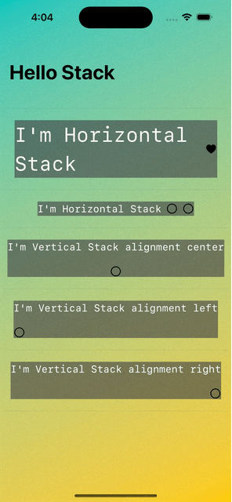

 
 
 

# SwiftUI-Practice

This SwiftUI-Practice demonstrates the fundamental concepts and features of Apple's SwiftUI framework. 

| Demo                                                                      |  Renderings                                                                                                        
| ------------------------------------------------------------------------  |  -----------------------------------------------------------------------------------------------------------  
| [Text-SwiftUI           ](SwiftUI-Content/Text-SwiftUI)           |       
| [Image-SwiftUI           ](SwiftUI-Content/Image-SwiftUI)           |     
| [Stack-SwiftUI           ](SwiftUI-ViewLayout/Stack-SwiftUI)           |      

