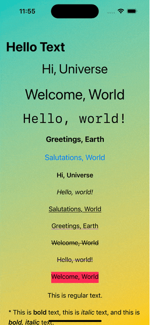

# SwiftUI-Practice
 
 
 
 
This SwiftUI Sample App demonstrates the fundamental concepts and features of Apple's SwiftUI framework. 
It is designed to help developers understand and implement various SwiftUI components and architectural patterns in their applications.

| Demo                                                                      |  Renderings                                                                                                        
| ------------------------------------------------------------------------  |  -----------------------------------------------------------------------------------------------------------  
| [Text-SwiftUI           ](SwiftUI-Content/Text-SwiftUI)           |                       

